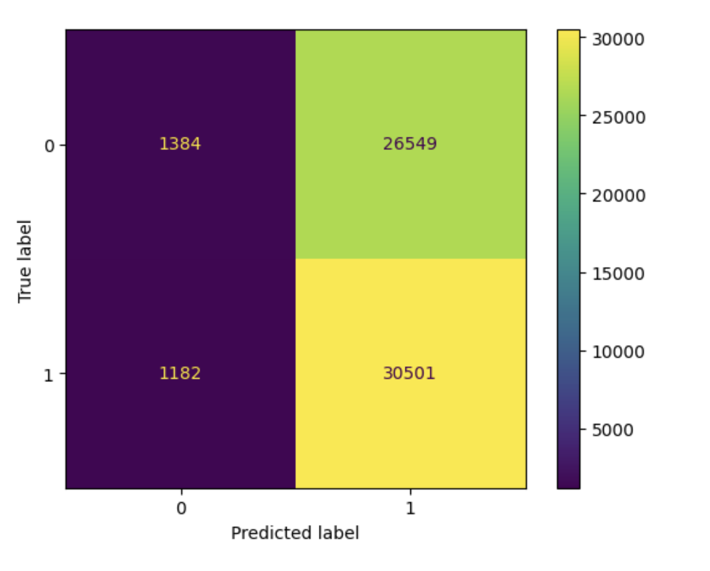
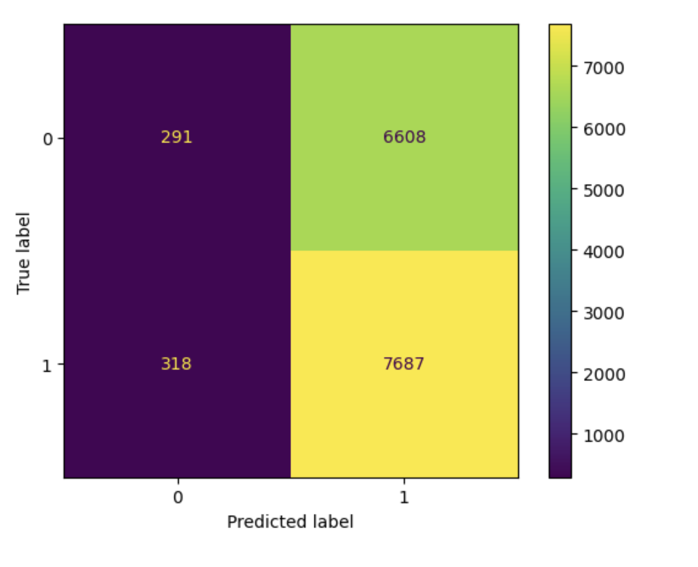

# Recipe Prediction
Author: Tianyi Chen

This is a project for DSC 80 Fall 2023

# Problem Identification

As we explore the recipe data set in the Recipe Research Project, we realize that the rating of a recipe is a valuable measure of the quality and popularity of a recipe. Predicting the rating based on recipes's information can improve the user experience of the website by recommending recipes that are predicted to have high rating. In this project, we are going to predict the rating of a recipe based on the information of the recipes. Since we are going to choose whether we are going to recommend the recipe to a user, we need to build a two-class classficiation model.

We will create a response variable `recommend` based on the rating of he recipe. Specifically, we will set a threshold for rating of each recipe, we will consider recommend the recipe to the user if the recipe's rating is higher than the threshold. We will discuss the choice of threshold in later part.

We will use precision as the main metric to evaluate the model with the aid of accuracy and recall. We believe that precision is most important because we want to reduce the propotion of false positive. Recommending recipes that is not so good to user will negatively influence the user expereience. 

At the time of prediction, we should know all the information of the recipe, that is, we have all the information of each column in the `recipe` dataframe, since those information are provided when the creator submit the recipe to the website. However, we do not know information on the feedback provided by the user, especially, we do not want to use `rating` as feature for our model as it determines the response variable.

We first performs data cleaning process similar to the Recipe Research Project. But we did some additional work.

1. We "expand" the nutrition column to multiple columns containing the nutrition of each type, i.e. calories (#), total fat (PDV), sugar (PDV), sodium (PDV), protein (PDV), saturated fat (PDV), carbohydrates (PDV). 
2. We created a new binary column `recommend`, setting it to 1 if the average rating for that recipe is higher than 4.9. We obtain the threshold 4.9 by inspecting the distribution of average rating in the dataframe.  
<iframe src="img/distrb.html" width=800 height=600 frameBorder=0></iframe>

3. We droped all the columns that we do not have information by the time of prediction.

# Baseline Model

In the baseline model we will use 2 features `minutes` and `calories`. We believe that these two features are important because by result from Recipe Research Project, we know that people may prefer recipes takes longer to cook. Also, people may prefers food higher calories as it may contains more sugar. 

Both features are quantitative, but we will set a threshold for calories so that recipes with calorise higher than the threshold will be considered as high calories. By some research, we decide that 400 will be our threshold for calories. So we decide to use a Binarizer to transform `calories` and leave `minutes` as it is.

We trained a fits a Decision Tree Classfier on the training set and get the following evaluation on training set

| Metric    | Precision | Accuracy | Recall    |
|-----------|-----------|----------|-----------|
| Value     | 0.5371182902232758      | 0.5371712292002148     | 0.9550459292814899   |

and following evaluation on the test set

| Metric    | Precision | Accuracy | Recall    |
|-----------|-----------|----------|-----------|
| Value     | 0.5312300149221915      | 0.528918411164788     | 0.9463291139240506  |

We realize that the model still need some improvement. The precision of the model, which is what we most care about, is not very high. Although it has a high recall, it is probably due to the bias in our data set. As we see in the previous part, the distribution of rating is highly screwed to the left. 

# Final Model
In the final model, we will add one more features, `n_ingredients` and break the `calories` feature into more detailed nutrients, namely, `sugar` and `total fat`. The number of ingredients is a good measure of complexity of a recipe, we believe, since more ingredients meaning more flavor in the food. While still believing people prefer high calorie food, we break `calories` into `sugar` and `total fat` for more detail so that it can improve our model. Furthermore, we will standarize `minute` and use quantiles for `Sugar` and `Fat`. 

We decided to use Random Forest Classfier for our model, since the data set we got is highly skewed to the left, the bootstraping process of Random Forest can help reduce the bias caused by such skewness. In order to find the best hyperparameter, we will do grid search and a cross-validation.
Since grid search takes a long time to run while facing many choices for hyperparameter. We first limited the number of choice for each hyperparameter, then check for the best parameter given by the grid search. If some of the hyperparameter is edge values in our choice, we can change the interval for that hyperparamter and do grid search again. 

After few tries, we get the best parameter as below. 

| Hyperparameter        | Value |
|-----------------------|-------|
| bootstrap             | True  |
| criterion             | gini  |
| max_depth             | 5     |
| min_samples_split     | 50    |
| n_estimators          | 20    |

Then we fit the model use above hyperparameters and evalute on the training set

| Metric    | Precision | Accuracy | Recall    |
|-----------|-----------|----------|-----------|
| Value    | 0.9626929268061737      | 0.5348396403650026    | 0.5346362839614374  |

The Confusion Matrix:

Evaluation on the test set is below

| Metric    | Precision | Accuracy | Recall    |
|-----------|-----------|----------|-----------|
| Value    |0.9602748282323548      | 0.5352925389157274    | 0.5346362839614374  |

The Confusion Matrix:

The precision of the model significantly improved! And the accuracy also improved, though not by a noticable amount. Unfortunately, the recall of the model actually decreased. A decrease recall meaning higher propotion of false negative, meaning we are recommending less recipes that are suppose to be good. However, comparing to the sigificant improve of precision, we are no longer recommending recipes that is not so good to user. This can improve the user experience a lot.

# Fairness Analysis

We want to see if our model performs differently on older recipes and newer recipes. The year of submission of recipes ranges from 2008 to 2018, so we will use 2013 as our threshold for determine if the recipe is old or new. We performs a permutatuon test on the data set and use precision, which is the one we most care about, to evaluate the model. And the test statistic will be absolute difference between precision.

Null Hypothesis: Our model is fair. The precision on old recipes is the same as the precision on new recipes.

Alternative Hypothesis: Our model is unfair. The precision on old recipes is different from the precision on new recipes.

By doing 1000 permutation test, we get a p-value of 0.286. Since p>0.05, we fail to reject the null hypothesis that our model is fair. So we cannot conclude that our model is unfair for the two groups. 